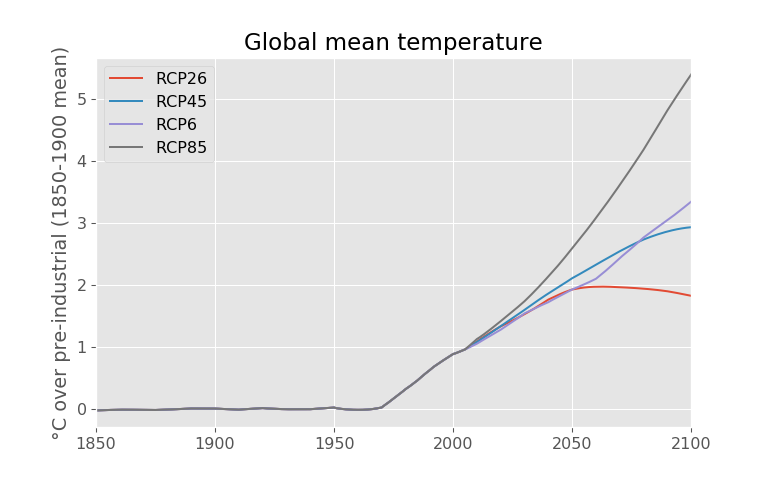

# pyhector

[](https://travis-ci.org/swillner/pyhector)
[](https://pypi.python.org/pypi/pyhector)
[](https://pypi.python.org/pypi/pyhector)
[](http://mybinder.org/repo/swillner/pyhector)

**pyhector** is a Python wrapper for the simple global climate
carbon-cycle model [Hector](https://github.com/JGCRI/hector).

The Python interface **pyhector** is developed by [Sven Willner](http://www.pik-potsdam.de/~willner/)
and Robert Gieseke at the [Potsdam Institute for Climate Impact Research](https://www.pik-potsdam.de/).

The C++-**[Hector](https://github.com/JGCRI/hector)** model is developed at the [Pacific
Northwest National Laboratory](https://www.pnl.gov/) and described in

> Hartin, C. A., Patel, P., Schwarber, A., Link, R. P., and Bond-Lamberty, B. P.: A simple object-oriented and open-source model for scientific and policy analyses of the global climate system – Hector v1.0, Geosci. Model Dev., 8, 939-955, [doi:10.5194/gmd-8-939-2015](https://dx.doi.org/10.5194/gmd-8-939-2015), 2015.

## Usage

This repository also contains a Jupyter Notebook you can [try live](http://mybinder.org/repo/swillner/pyhector).

```python
import pyhector
from pyhector import rcp26, rcp45, rcp60, rcp85

import matplotlib.pyplot as plt

for rcp in [rcp26, rcp45, rcp60, rcp85]:
    output, params = pyhector.run(rcp, {"core": {"endDate": 2100}})
    temp = output["temperature.Tgav"]
    # Adjust to 1850 - 1900 reference period
    temp = temp.loc[1850:] - temp.loc[1850:1900].mean()
    temp.plot(label=rcp.name.split("_")[0])
plt.title("Global mean temperature")
plt.ylabel("°C over pre-industrial (1850-1900 mean)")
plt.legend(loc="best")
```




## Install

### Prerequisites

[Hector](https://github.com/JGCRI/hector)
requires [Boost](http://www.boost.org/), so to install and use
**pyhector** you need to have the filesystem and system modules
of *Boost* version 1.52 or later installed (see also the
[Hector build instructions](https://github.com/JGCRI/hector/wiki/BuildHector)).

E.g., on Ubuntu/Debian these can be installed by invoking
```bash
sudo apt-get install libboost-filesystem-dev libboost-system-dev
```

### Install using pip

You can simply install **pyhector** from [PyPI](https://pypi.python.org/pypi/pyhector) by invoking
```bash
pip install pyhector
```


## Changelog

### 0.3.0

- default config object uses Python numbers or booleans instead
  of strings, units can be included as tuples like `(35.0, 'pptv')` and time
  series as lists of tuples like
  `'N2ON_emissions': [(1765, 11), (2000, 8), (2300, 8)]`

### 0.2.4

- first PyPI beta release


## Development

For local development you can clone the repository, update the
dependencies and install in a virtual environment with `pip`.

```bash
git clone https://github.com/swillner/pyhector.git --recursive
cd pyhector
python3 -m venv venv
./venv/bin/pip install --editable .
```

To update **pyhector** and all submodules you can run
```bash
git pull --recurse-submodules
git submodule update --init --recursive
./venv/bin/pip install --editable .
```

Tests can be run locally with

```
python setup.py test
```
