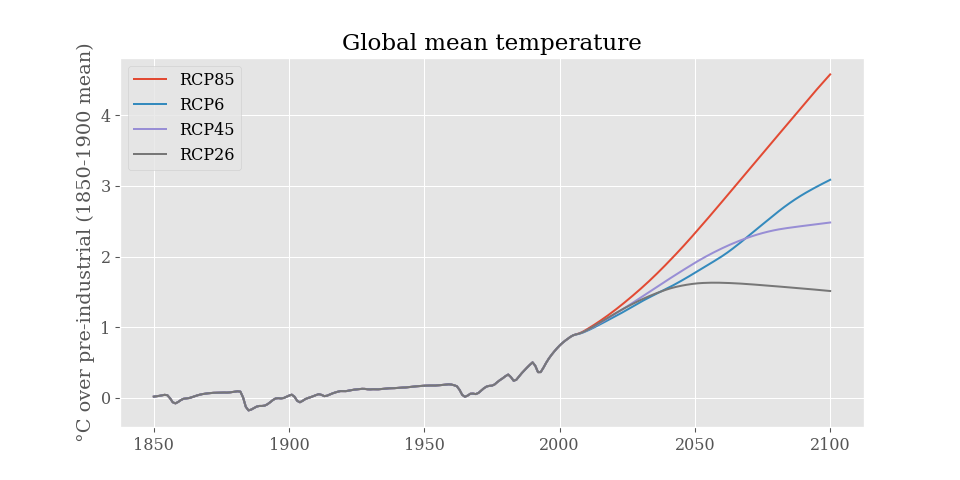

pyhector
========

+----------------+------------------------+
| |PyPI Version| | |PyPI Python Versions| |
+----------------+------------------------+
| |Docs|         | |Launch Binder|        |
+----------------+------------------------+
| |JOSS|         | |Zenodo|               |
+----------------+------------------------+

.. sec-begin-index

**pyhector** is a Python interface for the simple global climate
carbon-cycle model `Hector <https://github.com/JGCRI/hector>`_.

**pyhector** makes the simple climate model Hector easily installable
and usable from Python and can for example be used in the analysis of
mitigation scenarios, in integrated assessment models, complex climate
model emulation, and uncertainty analyses.

`Hector <https://github.com/JGCRI/hector>`_ is written in C++ and
developed at the `Pacific Northwest National Laboratory
<https://www.pnl.gov/>`_. The model description is published in

    Hartin, C. A., Patel, P., Schwarber, A., Link, R. P., and
    Bond-Lamberty, B. P.: A simple object-oriented and open-source
    model for scientific and policy analyses of the global climate
    system – Hector v1.0, Geosci. Model Dev., 8, 939-955,
    `doi:10.5194/gmd-8-939-2015
    <https://doi.org/10.5194/gmd-8-939-2015>`_, 2015.

See the Hector `repository <https://github.com/JGCRI/hector>`_ and
`wiki <https://github.com/JGCRI/hector/wiki>`_ for further
information.

The Python interface **pyhector** is developed by `Sven Willner
<http://www.pik-potsdam.de/~willner/>`_ and `Robert Gieseke
<https://github.com/rgieseke>`_.

Pyhector uses `pybind11 <https://github.com/pybind/pybind11>`_ to wrap
Hector's API. The version of Hector used can be read using Pyhector's
``__hector_version__`` field.

.. sec-end-index
.. sec-begin-installation

Installation
------------

Prerequisites
~~~~~~~~~~~~~

`Hector <https://github.com/JGCRI/hector>`_ requires `Boost
<http://www.boost.org/>`_, so to install and use **pyhector** you need
to have the filesystem and system modules of *Boost* version
1.52 or later installed (see also the `Hector build
instructions <https://github.com/JGCRI/hector/wiki/BuildHector>`_).

On Ubuntu/Debian these can be installed by invoking

.. code:: bash

    sudo apt-get install libboost-filesystem-dev libboost-system-dev

On macOS *Boost* is available through the Homebrew package manager, it
might be advisable to use a Homebrew installed Python for installing
**pyhector**:

.. code:: bash

    brew install boost

Windows is (as Hector) in principle supported but not yet tested for
**pyhector**. Pull request with installation notes for Windows are
welcome.

Install using pip
~~~~~~~~~~~~~~~~~

You can simply install **pyhector** from
`PyPI <https://pypi.python.org/pypi/pyhector>`_ by invoking

.. code:: bash

    pip install pyhector

.. sec-end-installation
.. sec-begin-usage

Usage
-----

This repository also contains a `Jupyter Notebook
<https://jupyter.readthedocs.io/en/latest/index.html>`_ you can `run
live <http://mybinder.org/repo/openclimatedata/pyhector>`_ and
experiment with, courtesy of the `Binder <http://mybinder.org/>`_
project. The notebook can be viewed as a `static version
<http://nbviewer.jupyter.org/github/openclimatedata/pyhector/blob/master/index.ipynb>`_
using nbviewer.

Basic example
~~~~~~~~~~~~~

.. code:: python

    import pyhector

    output = pyhector.run(pyhector.rcp26)

Advanced example
~~~~~~~~~~~~~~~~

.. code:: python

    import pyhector
    from pyhector import rcp26, rcp45, rcp60, rcp85

    import matplotlib.pyplot as plt

    for rcp in [rcp26, rcp45, rcp60, rcp85]:
        output = pyhector.run(rcp, {"core": {"endDate": 2100}})
        temp = output["temperature.Tgav"]
        # Adjust to 1850 - 1900 reference period
        temp = temp.loc[1850:] - temp.loc[1850:1900].mean()
        temp.plot(label=rcp.name.split("_")[0])
    plt.title("Global mean temperature")
    plt.ylabel("°C over pre-industrial (1850-1900 mean)")
    plt.legend(loc="best")
    plt.show()

.. image-start

.. image-end
.. sec-end-usage
.. sec-begin-development

Development
-----------

For local development you can clone the repository, update the
dependencies and install in a virtual environment with ``pip``.

.. code:: bash

    git clone https://github.com/openclimatedata/pyhector.git --recursive
    cd pyhector
    python3 -m venv venv
    ./venv/bin/pip install --editable .

To update **pyhector** and all submodules you can run

.. code:: bash

    git pull --recurse-submodules
    git submodule update --init --recursive
    ./venv/bin/pip install --editable .

Tests can be run locally with

::

    python setup.py test

.. sec-end-development

.. |PyPI Python Versions| image:: https://img.shields.io/pypi/pyversions/pyhector.svg
   :target: https://pypi.org/project/pyhector/
.. |PyPI Version| image:: https://img.shields.io/pypi/v/pyhector.svg
   :target: https://pypi.org/project/pyhector/
.. |Docs| image:: https://img.shields.io/badge/docs-latest-brightgreen.svg?style=flat
   :target: https://pyhector.readthedocs.io/en/latest/
.. |Launch Binder| image:: https://img.shields.io/badge/launch-binder-e66581.svg
   :target: https://mybinder.org/v2/gh/openclimatedata/pyhector/master?filepath=notebooks/index.ipynb
.. |JOSS| image:: https://img.shields.io/badge/JOSS-10.21105%2Fjoss.00248-brightgreen.svg
   :target: https://doi.org/10.21105/joss.00248
.. |Zenodo| image:: https://zenodo.org/badge/DOI/10.5281/zenodo.1194599.svg
   :target: https://zenodo.org/record/1194599
