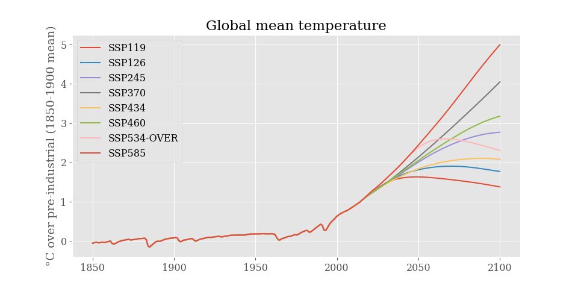

.. pyhector documentation master file, created by
   sphinx-quickstart on Thu Mar  9 15:08:38 2017.
   You can adapt this file completely to your liking, but it should at least
   contain the root `toctree` directive.

.. include:: ../README.rst
    :end-before: image-start

.. include:: ../README.rst
    :start-after: image-end

.. include:: ../CHANGELOG.rst

API docs
--------

.. toctree::
    :maxdepth: 2

    pyhector
